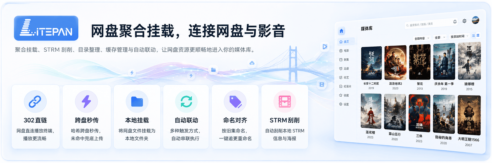
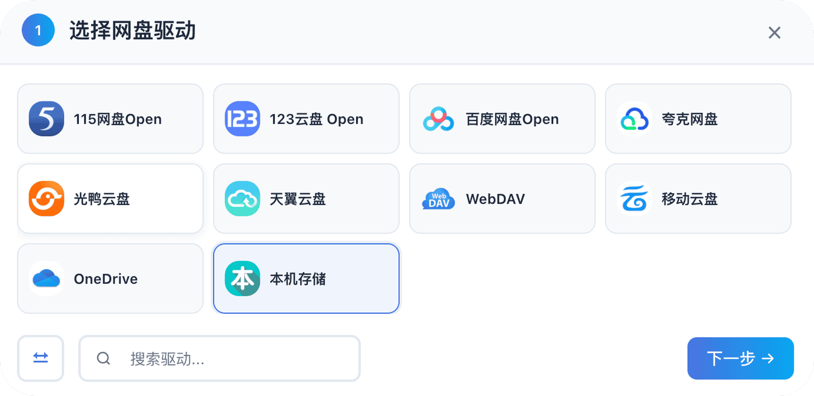
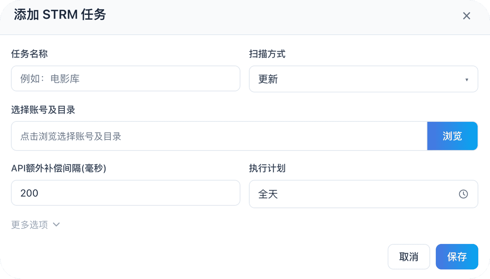
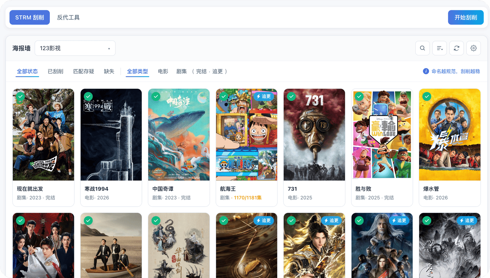
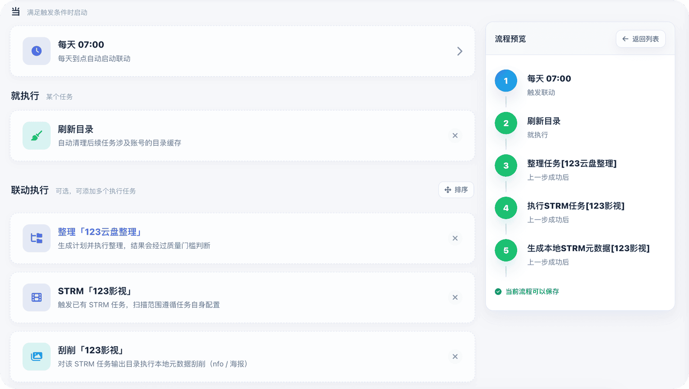

来自https://github.com/Ponphil/LitePan
<a name="readme-top"></a>

> ## 📱 LitePan Android 客户端（本仓库新增）
>
> 本仓库在原版服务端的基础上，新增了一个原生 Android 客户端工程（`android/` 目录）：
> 用 WebView 承载 LitePan 网页端，支持文件上传选择、普通下载与 `blob:` 下载、云盘 OAuth 跳转、
> SSE 上传进度、下拉刷新、摄像头授权（网页扫码）以及局域网 `http://` 访问。
>
> - **安装包下载**：见 [Releases](../../releases) 页面，下载 `*-release.apk` 后允许"安装未知来源应用"即可，个人使用无需上架应用商店。
> - **首次使用**：先部署 LitePan 服务端（Docker，默认端口 `5211`），App 启动后填写服务端地址，例如 `http://192.168.1.10:5211`。
> - **在线构建**：推送代码或推送 `v*` 标签时，GitHub Actions（`.github/workflows/android-ci.yml`）自动在云端构建 APK，无需本地 Android 环境；打标签会自动发布 Release。
> - **本地构建**：用 Android Studio 打开 `android/` 目录，或执行 `cd android && ./gradlew :app:assembleRelease`（需 JDK 17 与 Android SDK 35）。
> - 最低支持 Android 7.0（minSdk 24），目标版本 Android 15（targetSdk 35）。

<div align="center">



<br>

<a href="https://www.litepan.top"></a>
&nbsp;
<a href="https://space.bilibili.com/1501989416"></a>
&nbsp;
<a href="https://hub.docker.com/r/ponphil/litepan"></a>


[![docker-pulls][docker-pulls-shield]][docker-url]
[![version][version-shield]][docker-url]
[![license][license-shield]][license-url]

</div>

<br>


<br>

## ▎ 功能简述

<table>
  <tr>
    <td width="50%" valign="top" align="center">
      <h3>多网盘聚合</h3>
      <p align="left">多账号统一管理，一个界面看完。</p>
      
    </td>
    <td width="50%" valign="top" align="center">
      <h3>跨盘秒传</h3>
      <p align="left">能秒传就秒传，否则自动上传。</p>
      
    </td>
  </tr>
  <tr>
    <td width="50%" valign="top" align="center">
      <h3>STRM 直连播放</h3>
      <p align="left">生成 <code>.strm</code>，对接 Emby / Jellyfin。</p>
      
    </td>
    <td width="50%" valign="top" align="center">
      <h3>STRM 刮削</h3>
      <p align="left">写 nfo / 海报，海报墙可追更。</p>
      
    </td>
  </tr>
  <tr>
    <td width="50%" valign="top" align="center">
      <h3>目录整理</h3>
      <p align="left">TMDB 识别，预览后再归档。</p>
      
    </td>
    <td width="50%" valign="top" align="center">
      <h3>自动联动</h3>
      <p align="left">整理、STRM、刮削、刷库串起来。</p>
      
    </td>
  </tr>
</table>

## ▎ 挂载与更多功能

支持 WebDAV 与 FUSE 本地挂载，另有 302 直链、缓存保持、命名对齐、HTTP/磁力离线下载、115/夸克分享链接转存，以及跨网盘平台的 PanSou 资源搜索与搜索结果一键转存等能力。

## ▎ 离线下载与分享转存

LitePan 的“离线下载”入口同时提供链接任务、BT 种子和分享转存。分享转存会直接调用对应网盘的转存接口，不经过本地下载和重新上传。

### 支持范围

| 网盘 | 普通离线下载 | 分享链接转存 | 认证要求 |
| --- | --- | --- | --- |
| 115 网盘 Open | HTTP / HTTPS / FTP / Magnet / ED2K / BT | `115.com`、`anxia.com`、`115cdn.com` | Open OAuth；分享转存还需网页版 Cookie |
| 夸克网盘 | 使用 LitePan 内置下载器处理 HTTP / HTTPS / Magnet | `pan.quark.cn` | 账号 Cookie |
| 123 云盘 Open | HTTP / HTTPS | 暂未支持 | Open API 凭据 |
| 光鸭云盘 | HTTP / HTTPS / FTP / Thunder / Magnet | 暂未支持 | 账号凭据 |
| 其他支持上传的网盘 | 使用 LitePan 内置下载器处理 HTTP / HTTPS / Magnet | 暂未支持 | 对应账号凭据 |

分享链接只能转存到相同网盘类型的当前账号。例如，夸克分享链接需要先在文件浏览器中选择夸克账号。

### 使用流程

1. 在文件浏览器中选择目标网盘账号，进入准备保存文件的目录。
2. 点击工具栏中的“离线下载”，切换到“分享转存”。
3. 粘贴分享链接或完整分享文案；提取码可单独填写，也可从“提取码、访问码、密码、`pwd`、`password`、`passcode`”等文本自动识别。
4. 点击“解析分享链接”。LitePan 会读取分享根目录并默认勾选全部项目。
5. 调整需要转存的文件或文件夹，确认保存位置后点击“转存已选内容”。
6. 115 转存成功后立即刷新目标目录；夸克异步转存会先进入任务列表，并由离线任务轮询更新最终状态。

当前分享预览展示分享根目录中的文件和文件夹。选中一个文件夹时，由网盘服务端递归转存其中内容；暂不提供在分享目录内部逐层浏览的界面。

### 115 分享 Cookie

`115_Open` 的常规文件操作和原生离线下载使用 OAuth Token，但 `webapi.115.com` 分享接收接口使用网页版 Cookie。使用 115 分享转存前，请编辑对应的 115 Open 账号，在“网页版 Cookie（分享转存）”中填写当前账号的完整网页版 Cookie。

Cookie 属于敏感凭据，请仅保存在自己的 LitePan 实例中。Cookie 失效后需要重新登录 115 网页版并更新账号配置。

### 接口与状态

分享转存采用两阶段接口：

```text
POST /api/files/offline-download/share/prepare
POST /api/files/offline-download/share
```

`prepare` 只向前端返回短期 `preparation_id` 和可选择的文件列表。夸克 `stoken`、`share_fid_token` 与 115 分享参数保存在服务端内存中，绑定解析时使用的账号，并在 30 分钟后过期。转存任务记录只保存规范化分享 URL，不保存提取码或完整分享文案。

除手动粘贴外，前台 PanSou 搜索结果与后台「影视搜索转存」测试列表均提供「转存」按钮：选择目录后，分享链接会整份转存，磁力 / 电驴链接则交给支持离线下载的账号执行。

分享转存完成后会进入现有离线任务记录，并触发目录缓存失效、文件列表刷新和“离线下载完成”自动联动。空选择、过期 preparation、账号不匹配和重复提交都会返回校验错误。

---

## ▎ 资源站（ResourceHub）

聚合观影 / 聚影 / 帧影 三个影视资源分享站，一次输入片名即可同时在多个站点检索影视资源。搜索结果包含网盘分享链接与提取码，找到后可在结果右侧一键转存到自己的网盘目录。

### 开启与配置

1. 进入后台「增强工具 → 资源站」，点击「启用资源站聚合搜索」总开关。
2. 勾选要启用的站点（观影 / 聚影 / 帧影），并填写对应站点地址与登录凭据：
   - **观影站**：站点地址、用户名、密码；如遇验证码可粘贴浏览器 Cookie 跳过登录。
   - **聚影站**：站点地址、用户名、密码；可额外配置 App-Key 请求头（可选）。
   - **帧影站**：站点地址、用户名、密码；可额外配置 Token / Cookie（可选）。
3. 密码留空表示保留当前已保存的值，保存后不会回显到表单。
4. 可在后台「增强工具 → 资源站」的连通性测试中直接输入关键词验证各站点是否配置正确。
5. 如需转存时自动重命名，可开启「转存时使用资源站标题重命名」开关（默认关闭）。开启后一键转存单个夸克文件/文件夹时会自动使用搜索结果标题作为名称。

### 使用方式

- 启用后，前台首页显示「资源站」搜索入口；文件浏览器中也可随时打开资源站搜索面板（需要管理员身份登录）。
- 输入片名搜索，结果按来源站点展示分享链接、提取码与网盘类型标签。
- **一键转存**：每条结果右侧都有「转存」按钮，点击后在弹窗中选择目标网盘账号与保存目录（可新建文件夹），确认后整份资源直接转存到自己的网盘：
  - 分享链接（夸克 / 115 等）走对应网盘的分享转存接口，不经过本地下载与重新上传；
  - 站点没有可接收该资源的账号时按钮会置灰并说明原因（跨平台分享链接需要先绑定对应平台的网盘账号）；
  - 开启自动重命名后，仅单顶层 entry 的资源会被重命名为搜索标题，多顶层 entry 会跳过并保留原始名称。
- 后台「增强工具 → 资源站」的连通性测试结果同样提供搜索预览，可先行验证站点连通与搜索结果质量。
---

## ▎ 资源搜索（PanSou）
来自https://github.com/q107580018/LitePan

基于 PanSou 系列 API 的网盘资源聚合搜索：一次输入片名，即可跨多个已配置网盘平台检索分享链接，找到后可在结果右侧一键转存到自己的网盘目录，也可复制到离线下载 / 分享转存中手动提交。

### 开启与配置

1. 进入后台「设置 → PanSou 资源搜索」，启用功能。
2. 配置 PanSou 服务地址（默认 `https://so.252035.xyz`）。若上游需要鉴权，可填写 Basic Auth 用户名 / 密码，或 API Token。
3. 按需配置搜索平台范围（115、夸克、百度、阿里云盘、迅雷、天翼、UC、PikPak、磁力、ED2K 等）。仅 PanSou 认可的平台代号会被保留，避免“有配置却搜不到”。
4. 可在后台「增强工具 → 影视搜索转存」中直接测试关键词与平台组合。

### 使用方式

- 启用后，前台首页显示资源搜索入口；文件浏览器中也可随时打开 PanSou 搜索面板（需要管理员身份登录）。
- 输入片名搜索，结果按网盘平台展示分享链接与提取码。
- **一键转存**：每条结果右侧都有「转存」按钮，点击后在弹窗中选择目标网盘账号与保存目录（可新建文件夹），确认后整份资源直接转存到自己的网盘：
  - 分享链接（夸克 / 115 等）走对应网盘的分享转存接口，不经过本地下载与重新上传；
  - 磁力、电驴等链接会自动切换到支持离线下载的账号执行；
  - 站点没有可接收该资源的账号时按钮会置灰并说明原因（跨平台分享链接需要先绑定对应平台的网盘账号）。
- 后台「增强工具 → 影视搜索转存」的连通性测试结果同样提供「转存」入口，可先行验证一键转存链路。
- 复制目标链接后，也可在对应网盘账号的「离线下载 → 分享转存」中手动提交；两种方式共用同一套转存任务与进度追踪。

> [!NOTE]
> PanSou 为第三方聚合服务，可用性与返回内容取决于其上游服务。密码 / Token 属于敏感凭据，请仅保存在自己的 LitePan 实例中。

---

## ▎ 快速开始

**Docker Compose 部署** 

```yaml
services:
  litepan:
    image: ghcr.io/qiancheng817/litepan:latest
    container_name: litepan
    restart: unless-stopped
    ports:
      - "5211:5211"
      # 内置 Magnet 的 TCP/uTP/DHT 监听端口；若在后台修改，需同步调整映射
      - "42069:42069/tcp"
      - "42069:42069/udp"
    environment:
      - TZ=Asia/Shanghai
    volumes:
      - ./data:/app/data
      - ./strm:/app/strm
      - ./mounts:/app/mounts:shared

      # 可选：将 FUSE 读缓存单独映射，建议放到更快的磁盘
      # - ./fuse_read_cache:/app/data/fuse_read_cache
    devices:
      - /dev/fuse:/dev/fuse
    pid: "host"
    privileged: true
    # 没有代理环境的，可以在下方配置tmdb的hosts
    # extra_hosts:
      # - "api.themoviedb.org:这里填写对应的ip"
      # - "image.tmdb.org:这里填写对应的ip"
    # 注意：也可以在程序内「目录整理 → TMDB 设置」填写反代主域名（自动补 /3 与 /t/p），与 hosts 二选一即可
```

打开 `http://你的IP:5211`，默认管理员密码均为admin。  
需要 FUSE 时请确保宿主机具备 `/dev/fuse` 权限。


### 从本仓库的 GHCR 拉取自建镜像

本仓库 push 到 `main` 后会自动构建并发布多架构（amd64/arm64）镜像到 GitHub Container Registry。直接拉取：

```bash
docker pull ghcr.io/qiancheng817/litepan:latest
```


[docker-pulls-shield]: https://img.shields.io/docker/pulls/ponphil/litepan?logo=docker&logoColor=white&style=flat-square
[version-shield]: https://img.shields.io/badge/Version-v0.6.2-6C63FF?style=flat-square
[license-shield]: https://img.shields.io/badge/License-PolyForm%20NC-red?style=flat-square
[docker-url]: https://hub.docker.com/r/ponphil/litepan
[license-url]: ./LICENSE
